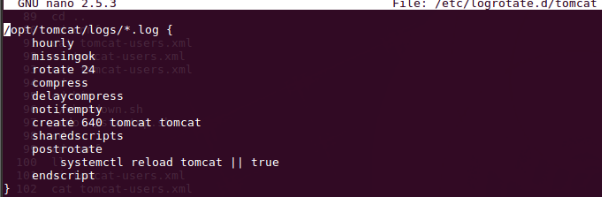
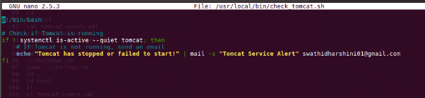
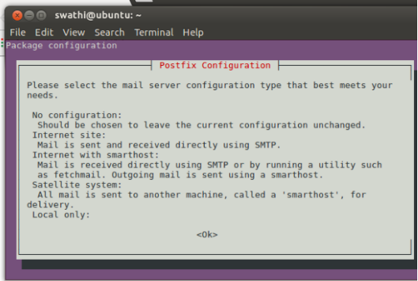
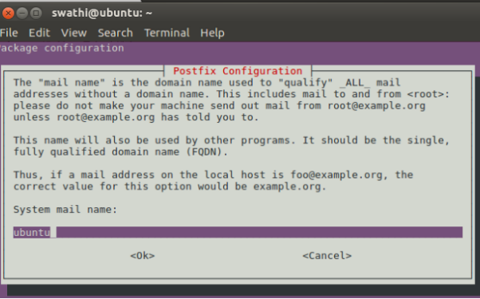
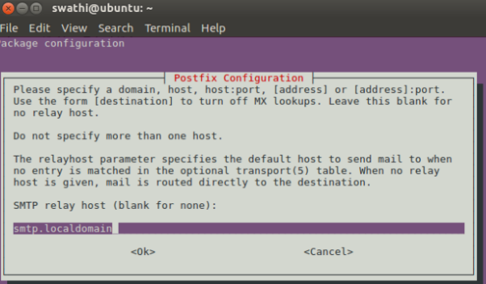
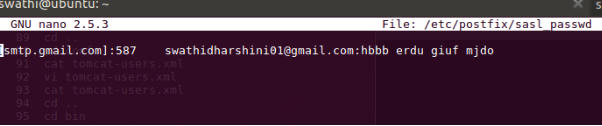
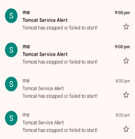
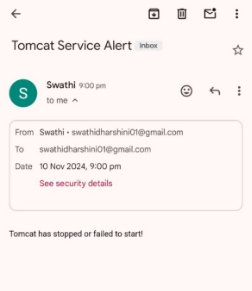

` `**ARCHIVING AND ROTATING LOG FILES, EMAIL NOTIFICATIONS FOR TOMCAT FAILURES**

**1. Archive and Rotate Log Files Every Hour**

To manage the rotation and archiving of log files for Tomcat, we can use logrotate, a Linux utility that automatically rotates, compresses, and mails log files. Here are the steps to configure log rotation for Tomcat:

**Step : 1 Install logrotate**

- sudo apt-get update
- sudo apt-get install logrotate

**Step :2  Configure logrotate for Tomcat Logs**

- Create a new configuration file for Tomcat logs
- Open or create the logrotate configuration file
- sudo nano /etc/logrotate.d/tomcat

Add the following configuration to rotate logs every hour, archive them, and retain old logs for a specific period:

/opt/tomcat/logs/\*.log { 

`    `hourly

`    `missingok

`    `rotate 24

`    `compress

`    `delaycompress

`    `notifempty

`    `create 640 tomcat tomcat

`    `sharedscripts

`    `postrotate

`        `systemctl reload tomcat || true

`    `endscript

}

Save and close the file crtl+o then enter ,ctrl+x

Step: 3 Test configuration

After making the changes, test the log rotation:

- sudo logrotate -f /etc/logrotate.d/tomcat

`                                `**2. Email Notification for Tomcat status**

**Step : 1 Install and configure mailutils**

\- sudo apt update

\- sudo apt install mailutils

Step 2: Create a Script to check tomcat status

1\.Create a shell script and check if tomcat is running and send email if it fail to start or stops

`  `- sudo nano /usr/local/bin/check\_tomcat.sh

2\.Add the following script :Replace <swathidharshini01@gmail.com> with your email address

#!/bin/bash

\# Check if Tomcat is running

if ! systemctl is-active --quiet tomcat; then

`    `# If Tomcat is not running, send an email

`    `echo "Tomcat has stopped or failed to start!" | mail -s "Tomcat Service Alert" admin@example.com

fi

Make the script executable

- sudo chmod +x /usr/local/bin/check\_tomcat.sh

if you're setting up email notifications and the required mail utilities, like mailutils, triggered the postfix installation. Here’s a step-by-step setup:

**Postfix Configuration Steps**

1. Choose the Mail Server Type
   In the postfix configuration screen, you'll see options like:

**Select "Internet with smarthost"** on this screen.

- Use the arrow keys to move to that option, and then press **Enter**.

**2.Set the system mail name**

Leave it as ubuntu or change it to localhost if you prefer use table key to select <ok>,press Enter.

**Configuring Internet with Smarthosr in Postfix**

1\.Smarthost (SMTP Replay)Address :

In this screen, **SMTP relay host** is asking for the hostname and port of the SMTP server you want Postfix to use for sending mail.

` `Replace smtp.localdomain with: **[smtp.gmail.com]:587**  then click ok

**Setting Up Postfix to Use Gmail's SMTP Server**

After completing the initial configuration, follow these steps:

1. **Open the Postfix configuration file**:
- sudo nano /etc/postfix/main.cf

  Add the following settings at the end of the file to configure Gmail’s SMTP:

1. **Add the following settings at the end of the file to configure Gmail’s SMTP:**

   relayhost = [smtp.gmail.com]:587

   smtp\_sasl\_auth\_enable = yes

   smtp\_sasl\_password\_maps = hash:/etc/postfix/sasl\_passwd

   smtp\_sasl\_security\_options = noanonymous

   smtp\_tls\_security\_level = encrypt

   smtp\_tls\_CAfile = /etc/ssl/certs/ca-certificates.crt

1. **Create the sasl\_passwd file to store your Gmail credentials**:
- sudo nano /etc/postfix/sasl\_passwd
- [smtp.gmail.com]:587    <your-email@gmail.com:your-> app password

  

  Steps to Generate an App Password for Gmail

`      `**Enable 2-Step Verification (if not already enabled)**:

- Go to Google Account Security.
- Under **"Signing in to Google,"** find **"2-Step Verification"** and enable it if it's not already turned on.

`     `**Generate an App Password**:

- Once 2-Step Verification is enabled, return to the **Security** section of your Google Account.
- Under **"Signing in to Google,"** Search for **"App Passwords"** and click on it.
- Google will display a 16-character password.
- copy it—this is the password you'll use instead of your main Google password.

**4.Secure and Hash the Password File**:

- sudo chmod 600 /etc/postfix/sasl\_passwd
- sudo postmap /etc/postfix/sasl\_passwd

**5.Restart Postfix**

- sudo systemctl restart postfix

  3. **. Create a crone jab to run the script every hour:**

Now, create a cron job to run this script every hour to check Tomcat's status and send an email notification if it’s stopped.

1\.Open your crontab for editing:

- **sudo crontab -e**

2\.Add the following line to run the script every hour:

`    `**- 0 \* \* \* \* /usr/local/bin/check\_tomcat.sh**
**
`    `- Save and exit

`   `- This cron job will execute the check\_tomcat.sh script at the start of every hour.

3\.Test your script:

To test whether the email is sent when Tomcat is not running, you can stop Tomcat manually:

- **sudo systemctl stop tomcat**

**ScreenShot**

` `

