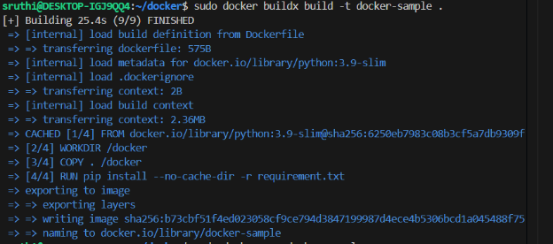
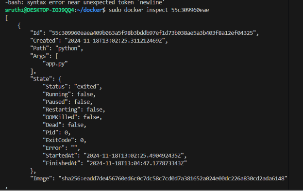
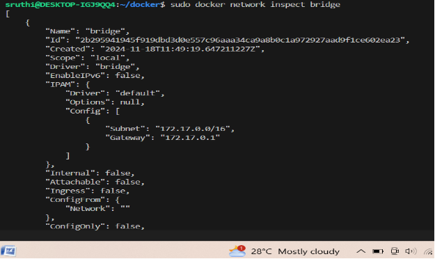
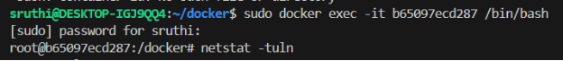
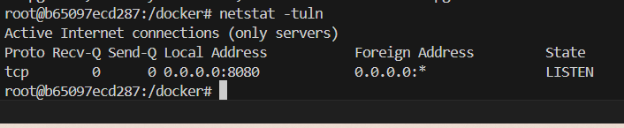
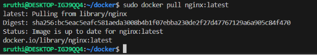
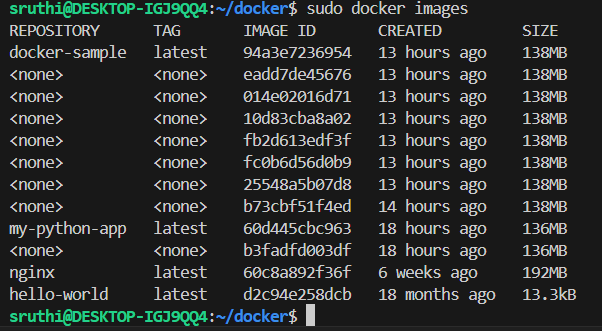

**DOCKER TUTORIAL 1**

- **What is ?**
1. **Container**

   Containers are isolated processes for each of your app's components. 

1. **Container VS Virtual machine**

   A container is simply an isolated process with all of the files it needs to run. If you run multiple containers, they all share the **same kernel**, allowing you to run more applications on less infrastructure.

   ` `A VM is an entire operating system with its **own kernel**, hardware drivers, programs, and applications.

1. **Image**

   A container image is a standardized package that includes all of the files, binaries, libraries, and configurations to run a container.

- **Write a Dockerfile**

  A Dockerfile is a text file that contains a set of instructions to build a Docker image.

  Create Dockerfile without  extension and type

  

1) FROM python:3.9-slim   # Docker hub to collect the base image
1) WORKDIR /app             # Set the working directory
1) COPY requirement.txt   # Copy the requirement to the container
   1. Flask 3.9
1) RUN pip install --no-cache-dir -r requirements.txt  # Install dependencies
1) EXPOSE 5000 	    #Expose a port
1) CMD ["python", "app.py", "--host", "0.0.0.0", "--port", "8080"]   # command,argument,host,port

- **CREATE  A DOCKER IAMGE**

docker build -t <name to your image>

- **RUN THE IAMGE**

  docker run -d -p 8080:80 nginx

1. –d  - Run the container in detached mode
1. –p - Map port 5000 on your local machine to port 5000 inside the container.(8080,80 any port)
1. nginx – image name

ERROR

Solution 

1. docker inspect <container id>

   # Find the network mode : bridge

1. sudo docker inspect 55c309960eae | grep -i "NetworkMode”  

   #You can inspect the bridge network itself to see the connected containers:

1. sudo docker network inspect bridge
1. sudo docker run --network bridge -p 8080:8080 docker-sample
1. http://localhost:8080/

**Check if Flask is Binding Correctly**

sudo docker exec -it <container-id> /bin/bash

netstat –tuln

**Pull image from Docker hub** 

**Check Docker images**

