`                          `**Docker**

**Docker** is a opensource software platformtool that allows you to build,test,deploy application using container.

**Container** is a runtime engine that allows developers to package application  with all parts needed such as libraries and other dependencies.containers contain the whole kit required for an application.so the application can run in isolated way in different environment.

**Docker images** is a file in the template formate is a set of instructions used to create a docker container in a read only format.

**Advantages** of using docker container is lightweight,fast delivery,reduce infrastructure cost.

**Docker Commands :**

**Docker containers**

**docker run --name <container name><image name>:**run a container from an image.

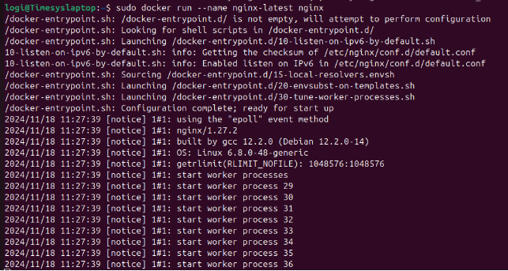

**docker run -d --name <container name><image name>:**run a container in detached mode.

**docker run -d -p  <port on host>:<port on container> --name <container name><image name>:**run a container with ports

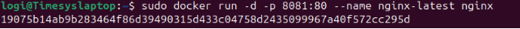

**docker ps:**List all running containers

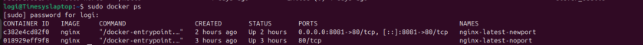

**docker ps -a:**List all containers,including stopped ones.

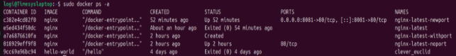

**docker stop <container name>:**stop a running container.

**docker start<container name>:**start a stopped container

**docker rm <container name>:**remove a stopped container

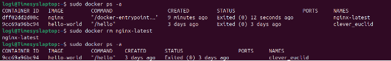

**docker restart <container name>:**restart a running container

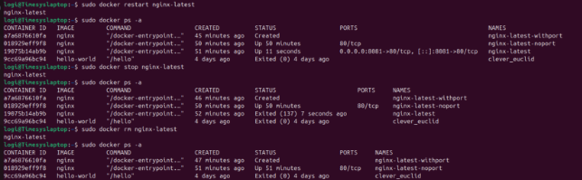

**docker exec -it <container><command>:**Execute a command inside a running container.

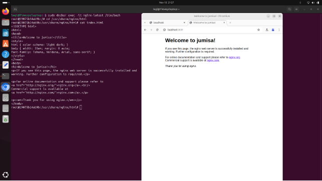

**docker logs <container name>:**view logs a container

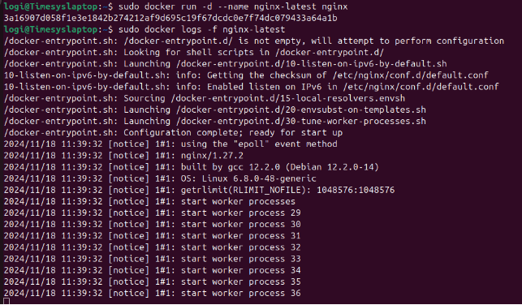

**docker inspect <container name>:**Get detailed information about a container.

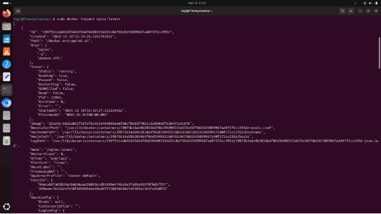

**Docker images**

**docker pull image name:**Download a image from registry

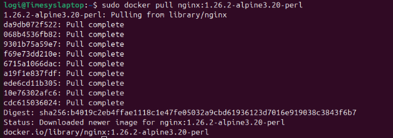

**docker images:**	List all downloaded images

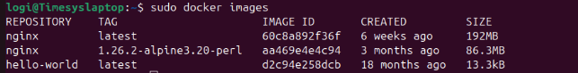

**System management**

**docker system df:**show docker disk usage

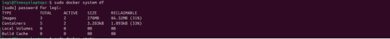

**docker stats :**Display realtime sats of runing containers.

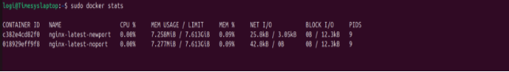

**docker info:**Display docker system-wide information

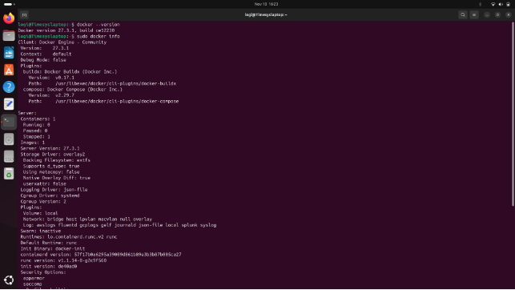

**Create a Docker file**

**Step1:**Create a index.html file

`            `mkdir ranjitha  \_\_ cd ranjitha \_\_ sudo vi index.html

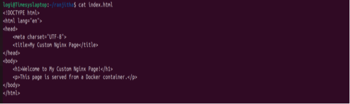

**Step2:**Create a Dockerfile

`           `sudo vi Dockerfile

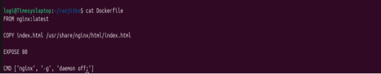

**Step3:**Build Docker image

`               `Run the following command in the directory containing your Dockerfile.

`               `docker build -t my-nginx-image .

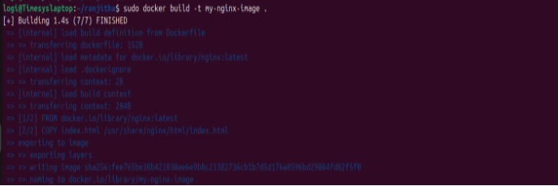

**Step4:**Run Custom NGINX Container
`           `Start a container from your custom image
**
`           `docker run --name my-custom-nginx1 -p 8082:80 -d my-nginx-             	   image

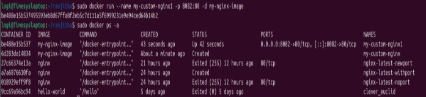

**Step5:Check web server** 

`           `localhost:8082

**Networks**

**docker network ls:**List all docker networks 

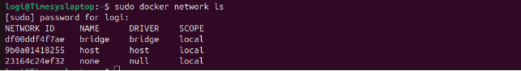

**docker exec -it <container1>/bin/bash:**logging into the container1

`     `Check networks and ip address of container1

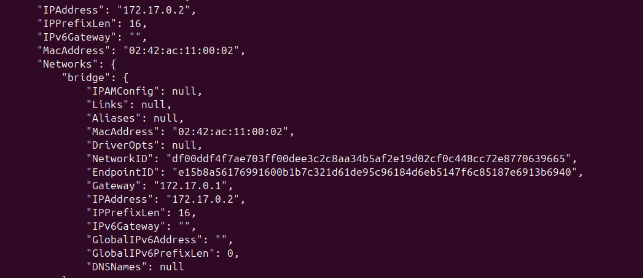

**docker exec -it <container2>/bin/bash:**Logging into container2

`       `Check networks and ip address of container2

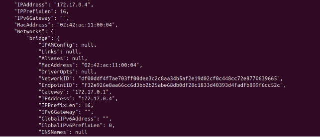

` `**docker exex -it <container1>/bin/bash:**ping container2 ip address** within the container1

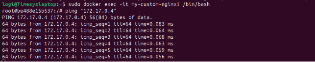
