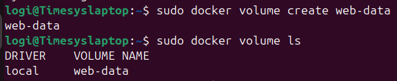
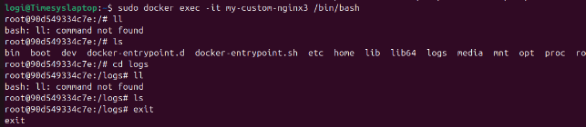

`                                    `**Volumes**

**Docker volumes** are a feature of docker that allows data to be stored and managed in the host even after removing the container.All volumes are stored in a dedicated directory on host in /var/lib/docker/volumes.We can use one volume to many containers. 

**docker volume create <volume> -** Create a new Docker volume

**docker volume ls**  -         List all Docker volumes.

**docker run -v <volume>:/path <image>** - Mount a volume in a container.

Volume assigning to the container1 in path ‘logs’

Logging to the container1 and checking the directory ‘logs’ and no files inside the directory.

Volume assiging to container2 in path /usr/share/nginx/html

s

Logging into container2 and checking the directory path /usr/share/nginx/html and we can see the two files.

Now logging into container1 and checking the container1 directory path ‘logs’ and we can see the two files stored in the container 2.

**docker volume inspect <volume-name>:**check the volume details

Docker stored the files in directory on host

