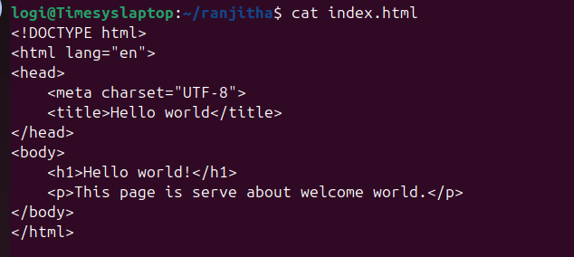
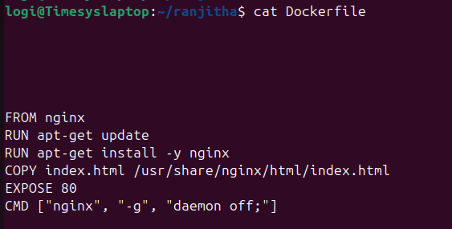
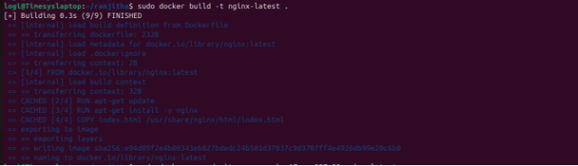
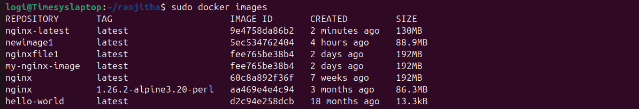
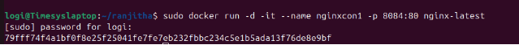
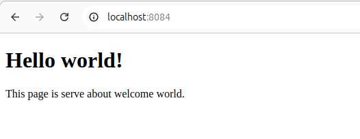

`                                             `**Create a Dockerfile**

`      `**Dockerfile** is a textfile that contains set of instructions for creating a       	container image.

`      `**Step1:Create a directory**

`     `Create a directory for your project where you will store your Dockerfile.

`      `mkdir ranjitha \_\_ cd ranjitha

`   `**Step2:Create a index.html file**
**
`                `Create a index.html file in a current directory(ranjitha)

`     `**Step3:Create the Dockerfile**

`     `Create an empty file named Dockerfile (without any file extension)

`     `touch Dockerfile

`    `**Step4:Open the Dockerfile in a Text Editor**
**
`              `Use your preferred text editor to open the Dockerfile.

`                  `Vi Dockerfile

**        

** 

**Base Image**:

FROM nginx

This line specifies that you're using the latest nginx image as the base.

**Update Package Lists**:

RUN apt-get update

This updates the package lists for the APT package manager.

**Install Nginx**:

RUN apt-get install -y nginx

This installs Nginx in the container

` `**Copy HTML File**:

COPY index.html /usr/share/nginx/html/index.html

This copies your local index.html file into the appropriate directory for Nginx to serve.

**Expose Port 80**:

EXPOSE 80

This tells Docker to expose port 80, which is the default port for nginx.

**Run Nginx in Foreground**

CMD ["nginx", "-g", "daemon off;"]

This command starts Nginx in the foreground, which is necessary for Docker containers to keep running.
## `  `**Step5:Building and Running  Docker Image**
##
## **1.Build Your Docker Image**
Navigate to the directory containing your Dockerfile and run:

` `docker build -t nginx-latest .

The -t flag tags your image with a name (nginx-latest), and the . specifies that the current directory should be used as the build context.

**

**2.Docker images:**Check docker images 

 

**3**.**Run Your Container**:
After building your image, you can run it using:

docker run -d -it –name nginxcon1 -p 8084:80 nginx-latest

This command runs your container in detached mode (-d), maps port 8084:80 and namesit nginxcon1 by using image nginx-latest.

**4.Access Your Application**:
Open the web browser and go to localhost:8084 to see application running.

##
