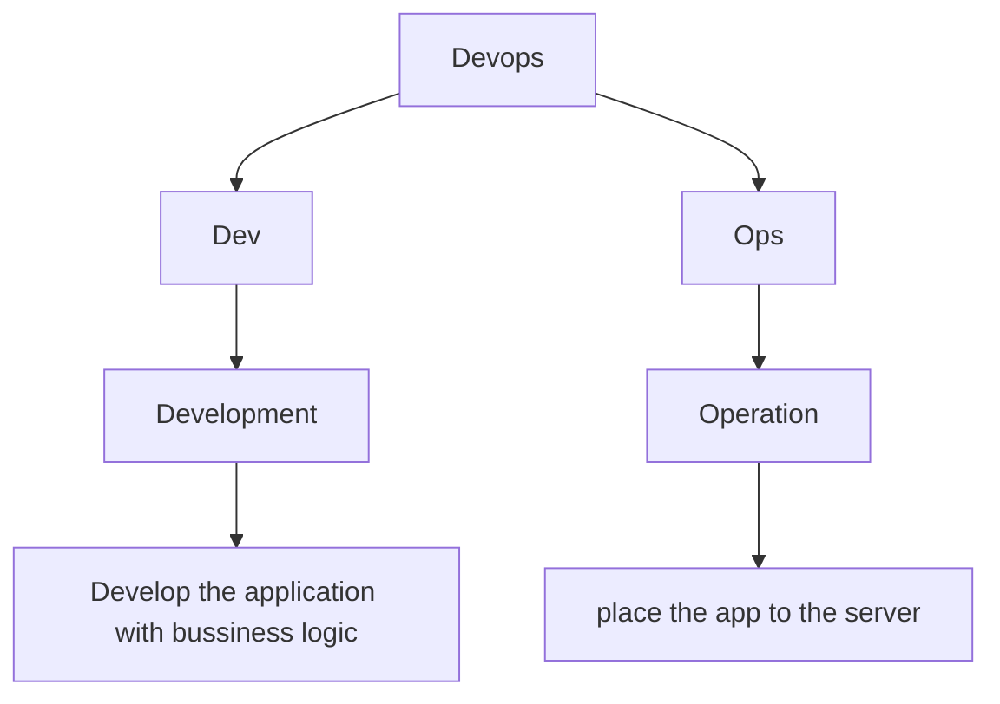

<h2>DevOps Azure - 2024</h2>

## Devops
DevOps, short for Development and Operations, is a set of practices, tools, and a cultural philosophy that aims to improve collaboration between software development (Dev) and IT operations (Ops). The primary purpose of DevOps is to shorten the software development lifecycle while ensuring high-quality software delivery.

## DevOps logic 
* Version control
* Shell scripting
* Deployment strategies
* Linux Administartion

## Topics
### Basics
* Basic 1 : Process management
   * System monitoring tools
   * Networking commands
   * SSH
* Basic 2 : Shell scripting
* Basic 3 : Crontab
* Basic 4 : Git
 ### Project 
* Phase 0 :[Tomcat](https://github.com/Sruthi-22012002/DevOps-Azure/tree/main/Tomcat)
* Phase 1 : [Docker](https://github.com/Sruthi-22012002/DevOps-Azure/tree/main/Docker)
* Phase 2 :[Sample Application](https://github.com/Sruthi-22012002/DevOps-Azure/tree/main/3-tier-application)
* Phase 3 : [GithubActions](https://github.com/Sruthi-22012002/DevOps-Azure/tree/main/githubActions)
