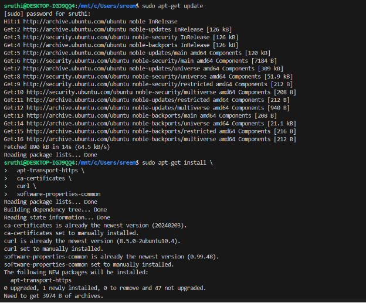
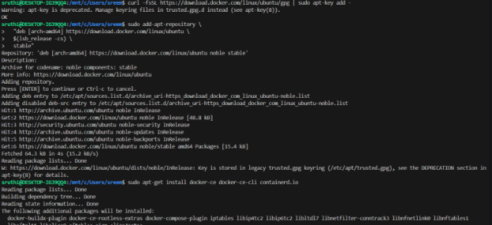

**DOCKER INSTALLATION**

1. **Update your package database**:

`  `sudo apt-get update

1. **Install required packages to allow apt to use a repository over HTTPS:**
**
`   	`sudo apt-get install \

`  	`apt-transport-https \

`  	`ca-certificates \

`  	`curl \

`  	`software-properties-common**	

1. **Add Docker's official GPG key:**

`      `curl -fsSL https://download.docker.com/linux/ubuntu/gpg | sudo apt-key add -

1. **Add Docker’s APT Repository**

   sudo add-apt-repository \

   `  `"deb [arch=amd64] https://download.docker.com/linux/ubuntu \

   `  `$(lsb\_release -cs) \

   `  `stable"

1. **Update the apt package index again**

   sudo apt-get update

1. **Install the latest version of Docker CE (Community Edition):**

   sudo apt-get install docker-ce docker-ce-cli containerd.io

1. **Verify the Docker installation:**

   docker --version

   docker run hello-world

![ref1]![ref1]

![ref2]

![ref2]

[ref1]: Aspose.Words.090d0c7b-d4fb-4bd6-92e1-d2488ed70d4d.004.png
[ref2]: Aspose.Words.090d0c7b-d4fb-4bd6-92e1-d2488ed70d4d.007.png
