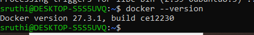
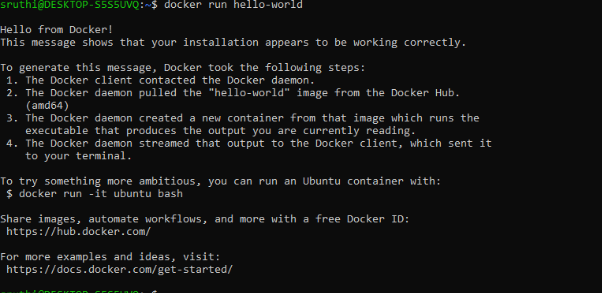
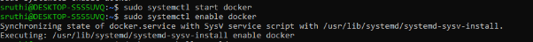
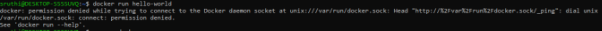

`			`**DOCKER INSTALLATION**

1. Open the terminal and update the package list

   `	`sudo apt update

1. Install the required dependencies

sudo apt install apt-transport-https ca-certificates curl software-properties-common

1. Add docker’s official key

curl -fsSL https://download.docker.com/linux/ubuntu/gpg | sudo gpg --dearmor -o /usr/share/keyrings/docker-archive-keyring.gpg

1. Set up the Docker stable repository

   `	`echo "deb [arch=amd64 signed-by=/usr/share/keyrings/docker-archive-keyring.gpg] https://download.docker.com/linux/ubuntu $(lsb\_release -cs) stable" | sudo tee /etc/apt/sources.list.d/docker.list > /dev/null

1. Update the index package again

sudo apt update

1. Install docker (community edition)

   `	`sudo apt install docker-ce

1. Verify Docker installation

   `	`docker --version

` 	`

1. Start and enable docker

   `	`sudo systemctl start docker

   sudo systemctl enable docker

1. Add user 

   sudo usermod -aG docker $USER

1. Run sample file

   

Issuse and solution 

Soln : 

`	`sudo systemctl status docker

`	`sudo systemctl start docker

sudo systemctl enable docker

`	`Soln : 	
