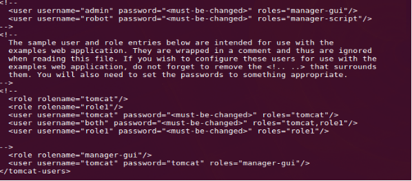
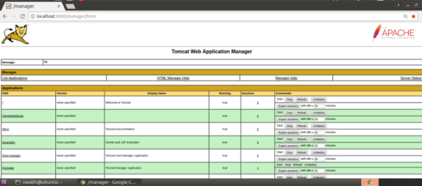
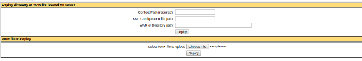
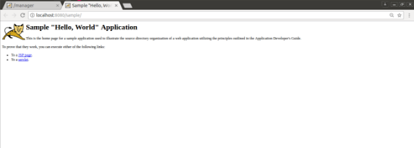

`                      `**TOMCAT INSTALLATION**

**Step: 1**

- Update the package index
- Command : **sudo apt update**

**Step: 2**

- Install OpenJDK11
- Command : **sudo apt install openjdk-11-jdk**
- Check the installed java version to confirm that OpenJDK 11 is installed 
- command: **java -version**

**Step: 3**

- Create a Tomcat user
- Command : **sudo useradd -m -U -d /opt/tomcat -s /bin/false tomcat**

**Step: 4**

- Download tomcat
- Navigate to the /temp directory give : **cd  /temp**
- Download tomcat version 8.5.100
- Command: **sudo wget https://archive.apache.org/dist/tomcat/tomcat-8/v8.5.100/bin/apache-tomcat-8.5.100.zip**

**Step : 5**

- Extract the tomcat package zip file
- Command : **unzip apache-tomcat-\*.zip**
- Move the tomcat package to /opt/tomcat
- Command : **sudo mv apache-tomcat-\*/ /opt/tomcat/**

**Step: 6**

- Create a symbolic link to the tomcat installation
- Create a symbolic link named latest that points to the tomcat installation directory ,making it easier to refer to the current version
- Command **: sudo ln -s /opt/tomcat/apache-tomcat-\* /opt/tomcat/latest**

**Step : 7**

- Give the permission to tomcat user of tomcat installation directory
- Command : **sudo chown -R tomcat: /opt/tomcat**

**Step : 8**

- Create a systemd service file for tomcat
- Open a new service file
- Command: **sudo nano /etc/systemd/system/tomcat.service**
- Add the following content into it

[Unit]

Description=Tomcat 8.5 servlet container

After=network.target

[Service]

Type=forking

User=tomcat

Group=tomcat

Environment="JAVA\_HOME=/usr/lib/jvm/java-11-openjdk-amd64/bin/java"

Environment="JAVA\_OPTS=-Djava.security.egd=file:///dev/urandom"

Environment="CATALINA\_BASE=/opt/tomcat/latest"

Environment="CATALINA\_HOME=/opt/tomcat/latest"

Environment="CATALINA\_PID=/opt/tomcat/temp/tomcat.pid"

Environment="CATALINA\_OPTS=-Xms512M -Xmx1024M -server -XX:+UseParallelGC"

ExecStart=/opt/tomcat/latest/bin/startup.sh

ExecStop=/opt/tomcat/latest/bin/shutdown.sh

[Install]

WantedBy=multi-user.target

- Save and close the file

**Step : 9** Start tomcat Automatically run

- Reload the system daemon to apply the new service file
- Command: **sudo systemctl daemon-reload**
- Start the tomcat service
- Command : **sudo systemctl start tomcat**
- Enable tomcat to start on boot:
- Command : **sudo systemctl enable tomcat**
- Verify tomcat is running or not give command : **sudo systemctl status tomcat**

**Step :10** Starting tomcat Manually run (am facing issue in automatic start so currently am using manually process)

- Navigate to tomcat bin directory
- Command : **cd /opt/tomcat/latest/bin**
- Start tomcat to run **startup.sh** script 
- Command : **./startup.sh**
- Stop tomcat use the **shutdown.sh** script
- Command : **./shutdown.sh**

**Step : 11**

- Access tomcat to open a web browser
- **http://localhost:8080**

![ref1]

` `------------------------------------------------------------------------------------------

`     `**DEPLOY AN APPLICATION IN TOMCAT SETUP**

**Step : 1**

- Edit the tomcat users configuration
- Command : sudo nano /opt/tomcat/latest/conf/tomcat-users.xml
- Add manager user (add this inside the <tomcat-users> tag

**<role rolename="manager-gui"/>**

**<user username="tomcat" password="tomcat" roles="manager-gui"/>**

**Step : 2**

- Start the tomcat service if you’re running in manually
- cd /opt/tomcat/latest/bin 
- ./startup.sh
- Or if you’re using systemd give command: sudo systemctl start tomcat
- open a web browser and go to link [**http://localhost:8080**](http://localhost:8080)

  ![ref1]

**Step : 3**

- **In the tomcat show home page ,click Manager App and opened it** 
- 

**Step : 4**

- Deploy a war file 
- Go to google search sample war file for tomcat download it
- And upload in war file to deploy

  

**Step : 5**

- **Access the application give url : [http://localhost/project-name**](http://localhost/project-name)**
- **localhost:8080/sample**

[ref1]: Aspose.Words.f2572bc0-6cb0-4430-b329-eb4ad7da5c37.001.jpeg
