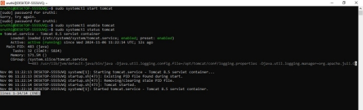


`			`**Tomcat Application Deployment**

1. **Start the tomcat server :**
1. **sudo systemctl start tomcat**
1. ` `**sudo systemctl enable tomcat**
1. ` `**sudo systemctl status tomcat**

1. **Localhost:8080.Shows the home page of Tomcat**

   ![ref1]

1. **Open manager app**

   ![ref1]

1. **Username and password**
   1. **User name : admin**
   1. **Password : adminpassword**

1. **Deploy the war file**

1. **Upload war file and deploy. Type url : localhost/project-name. The application will run :**

   

[ref1]: Aspose.Words.abffee04-dbe3-4746-9794-90d2b7b235b8.002.jpeg
