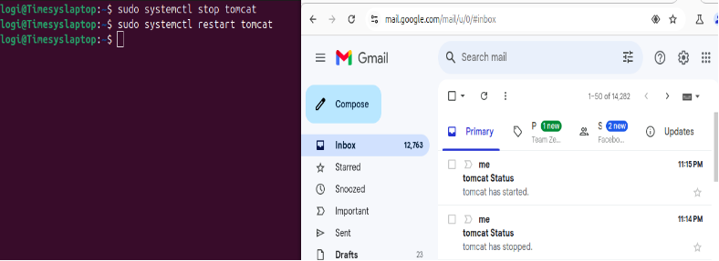

`        `**Email notification for Tomcat status**

**Step1:Install postfix**

`           `sudo apt install postfix

**Step2:Install mail Utilities** 
**
`           `sudo apt install mailutils

**Step3:Configure the SMTP server**

`           `sudo nano /etc/postfix/main.cf

**Step4:Add the following TLS parameter**
**

`              `smtpd\_tls\_cert\_file=/etc/ssl/certs/ssl-cert-snakeoil.pem

`              `smtpd\_tls\_key\_file=/etc/ssl/private/ssl-cert-snakeoil.key

`              `smtp\_tls\_CApath=/etc/ssl/certs

`              `smtp\_tls\_session\_cache\_database = btree:${data\_directory}/smtp\_scache

`              `smtpd\_relay\_restrictions = permit\_mynetworks, permit\_sasl\_authenticated, defer\_>

`              `myhostname = Timesyslaptop

`              `alias\_maps = hash:/etc/aliases

`              `alias\_database = hash:/etc/aliases

`              `mydestination = $myhostname, localhost.$mydomain, localhost, Timesyslaptop

`              `relayhost = [smtp.gmail.com]:587

`              `mynetworks = 127.0.0.0/8 [::ffff:127.0.0.0]/104 [::1]/128

`              `home\_mailbox = Maildir/

`              `mailbox\_size\_limit = 0

`              `recipient\_delimiter = +

`              `inet\_interfaces = all

`              `inet\_protocols = **ipv4**

**Step5:Enable Authentication**
**
   `           `relayhost = [smtp.gmail.com]:587

`              `smtp\_sasl\_auth\_enable = yes

`              `smtp\_sasl\_password\_maps = hash:/etc/postfix/sasl\_passwd

`              `smtp\_sasl\_security\_options = noanonymous

`              `smtp\_tls\_security\_level = encrypt

`              `smtp\_tls\_CAfile = /etc/ssl/certs/ca-certificates.crt 

**Step6:Create the SASL Password File**
**
`           `sudo nano /etc/postfix/sasl\_passwd
**
`           `[smtp.example.com]:587    your gmail.com:password

**Step7:Generate a App password**

**           Signing into Google                 navigate to security                         **enable** 2-step verification  

              search for App password         signin to your Gmail account          Type a name to create new app password                            copy the password

`              `replace your password   [smtp.example.com]:587 ranji.punitha94@gmail.com:zkqk czxu lleh srmb

**Step8:permissions for the password file**
**
`           `sudo chmod 600 /etc/postfix/sasl\_passwd

**Step9:Create a hash database for Postfix to use**
**
`           `sudo postmap /etc/postfix/sasl\_passwd
**

**Step10:Edit the Aliases File**
**
`           `sudo nano /etc/aliases

**Step11:Add your aliases in the following format**
**
`           `postmaster: root

`           `root: ranji.punitha94@gmail.com

`           `logi: ranji.punitha94@gmail.com

`           `aliases: <ranji.punitha94@gmail.com>

**Step12:Update the Aliases Database**
**
`           `sudo newaliases

**Step13:Reload Postfix**
**
`           `sudo systemctl reload postfix

**Step14:Create a script for monitoring tomcat**
**
`           `sudo nano /usr/local/bin/tomcat\_monitor.sh

**Step15:Add the following script**
**
`           `#!/bin/bash

`            `SERVICE="tomcat"

`            `STATUS=$(systemctl is-active $SERVICE)

`             `if [ "$STATUS" = "active" ]; then

`             `echo "$SERVICE has started." | mail -s "$SERVICE Status" ranji.punitha94@gmail.com

`             `elif [ "$STATUS" = "inactive" ]; then

`             `echo "$SERVICE has stopped." | mail -s "$SERVICE Status" ranji.punitha94@gmail.com

`             `fi

**Step16:Make the script executable**
**
`          `sudo chmod +x /usr/local/bin/tomcat\_monitor.sh
**

**Step17:Create a crontab** 
**
`           `crontab -e

**Step18:Add the following line**
**
`           `MAILTO="ranji.punitha94@gmail.com"

`           `\* \* \* \* \* /usr/local/bin/tomcat\_monitor.sh

**Step19:Test email notifications**
**
`           `sudo systemctl start tomcat 

`           `sudo systemctl stop tomcat

