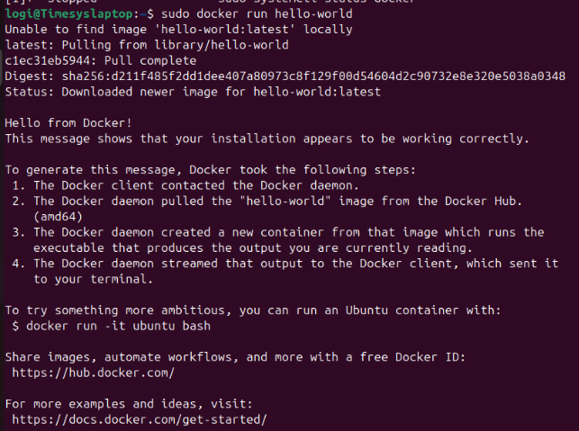

`                    `**Installation of Docker**

**Step1:Update the System**
**
`             `sudo apt update

**Step2:Install Required Dependencies**

`             `Install a few prerequisite packages that allow apt to use packages over HTTPS
**
`             `sudo apt install apt-transport-https ca-certificates curl software-properties-common -y

**Step3: Create a Keyring Directory**

`             `Create a directory for storing GPG keys if it doesn't already exist

`             `sudo mkdir -p /etc/apt/keyrings

**Step4:Download and Store the GPG Key**

`            `Use curl to download the Docker GPG key and store it in a keyring file

`            `curl -fsSL https://download.docker.com/linux/ubuntu/gpg | gpg --dearmor | sudo tee /etc/apt/keyrings/docker.gpg > /dev/null

**Step5:Set Up the Docker Repository**

`            `Add the Docker repository to your system's sources list

`            `echo "deb [arch=amd64 signed-by=/etc/apt/keyrings/docker.gpg] https://download.docker.com/linux/ubuntu $(lsb\_release -cs) stable" | sudo tee /etc/apt/sources.list.d/docker.list > /dev/null

**Step6**: **Update Package Index:**

`             `After setting up the key and repository, update your package index
**
`             `sudo apt update

**Step7:Install Docker**

`            `Now, install Docker Engine and related components

`            `sudo apt install docker-ce docker-ce-cli containerd.io docker-buildx-plugin docker-compose-plugin

**Step8:Verify Docker version**

`            `To ensure that Docker was installed correctly, check its version:

`	         `docker –version

**Step9:Verify Installation**

`            `Check if Docker is running properly by executing

`            `sudo systemctl status docker

**Step10:Run a Test Container**

`            `To confirm that Docker is functioning properly, run a test container
**
`           `sudo docker run hello-world

**Explanation of Output**

Hello from Docker!: This confirms that your Docker installation is functioning properly.

Steps Taken: The output describes how Docker works behind the scenes, including pulling the image and running it.

Next Steps: It provides suggestions for further exploration with Docker.

