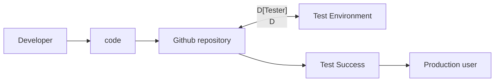

## Github Actions
### Github Action tools : 
* CI/CD
   > Continous Integration / Continous Delivery
     * Continous Integration
        > Build, Deploy, Test
    * Continous Delivery
       > Deliver to production user ( deliver to the server)
### How it works :



### Sample :
```bash
# The name of the workflow that appears in the GitHub Actions tab.
name: githubAction Workflow 

# Trigger the workflow on push or pull request events
on:
  push:
   # Defines which branches will trigger the workflow. Only main will trigger it.
    branches:
      - main
# Defines a set of tasks (or jobs) the workflow will run.
jobs:
  # The name of this job.
  build and push:
    # Specifies the environment where the job will run.
    runs-on: ubuntu-latest

    steps:
      # Check out the repository
      - name: Checkout code
        # Refers to a prebuilt action from GitHub’s marketplace, actions/checkout@v3, which checks out the repository so the workflow can access the code.
        uses: actions/checkout@v3

      - name: make the script exectable
        uses: sudo chmod +x date.sh

      - name: run the script
        uses: sh date.sh
```


      
