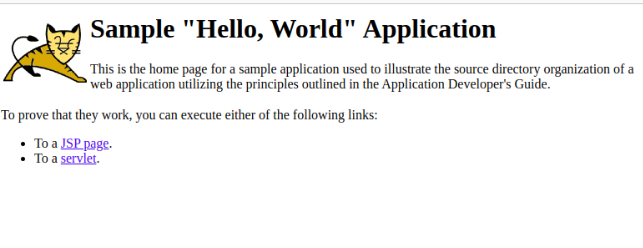

`                    `**Deploy a WAR file**

**Stpe1:** **Add ussername and password**

`           `/opt/tomcat/conf

`           `vi tomcat-users.xml

`           `<user username=”tomcat” password=”tomcat” roles=”manager-gui”/>
**

**Step2:sudo systemctl start tomcat**

**Step3:Open the browser and localhost:8080**

`            `Home page of tomacat opened

`            `Open manager app 

`            `username:tomcat

`            `password:tomcat

**Step4:Download the WAR file**
**

**Step5:WAR file to deploy**
**
`            `Select WAR file to upload

`            `Click deploy 

**Step6:Open WAR file**
**
`            `WAR file added to the applications

`            `Open the WAR file that have uploaded 

