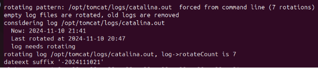
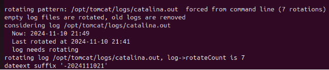
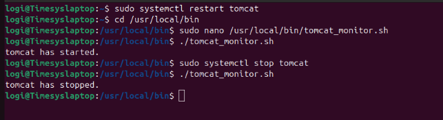

`         `**Logrotate and email notification**

**Step1:Configure Logrotate for Hourly Rotation**
**
`           `sudo nano /etc/logrotate.d/tomcat

**Step2:Adding the following configuration to rotate tomcat logs hourly**
**
`          `/opt/tomcat/logs/catalina.out {

`           `hourly

`           `rotate 7

`           `compress

`           `missingok

`           `create 0640 tomcat tomcat

`           `sharedscripts

            `postrotate
            
`           `systemctl restart tomcat

`           `endscript

}

**Step3:By default log rotates run daily.To make it run hourly,copy the daily log rotate script to the hourly directory.**
**
`          `sudo cp /etc/cron.daily/logrotate /etc/cron.hourly/   

**Step4:Setup email notifications for tomcat events**
**

**Step5:Install mail Utilities** 
**
`           `sudo apt install mailutils

**Step6:Create a script for monitoring tomcat**
**
`           `sudo nano /usr/local/bin/tomcat\_monitor.sh

**Step7:Add the following script**
**
`           `#!/bin/bash

`            `SERVICE="tomcat"

`            `STATUS=$(systemctl is-active $SERVICE)

`             `if [ "$STATUS" = "active" ]; then

`             `echo "$SERVICE has started." | mail -s "$SERVICE Status" ranji.punitha94@gmail.com

`             `elif [ "$STATUS" = "inactive" ]; then

`             `echo "$SERVICE has stopped." | mail -s "$SERVICE Status" ranji.punitha94@gmail.com

`             `fi

**Step8:Make the script executable**
**
`          `sudo chmod +x /usr/local/bin/tomcat\_monitor.sh

**Step9:Setup a cron job to run the script every minute**
**
`           `crontab -e**           

**Step10:Add the following line**

`           `0 \* \* \* \* /usr/local/bin/tomcat\_monitor.sh

`           `0 \* \* \* \* /usr/sbin/logrotate /etc/logrotate.conf

**Step11:Test log rotation** 
**
`           `sudo logrotate -vf /etc/logrotate.d/tomcat

**Step12:Test email notifications**
**
`           `sudo systemctl start tomcat 

`           `sudo systemctl stop tomcat

